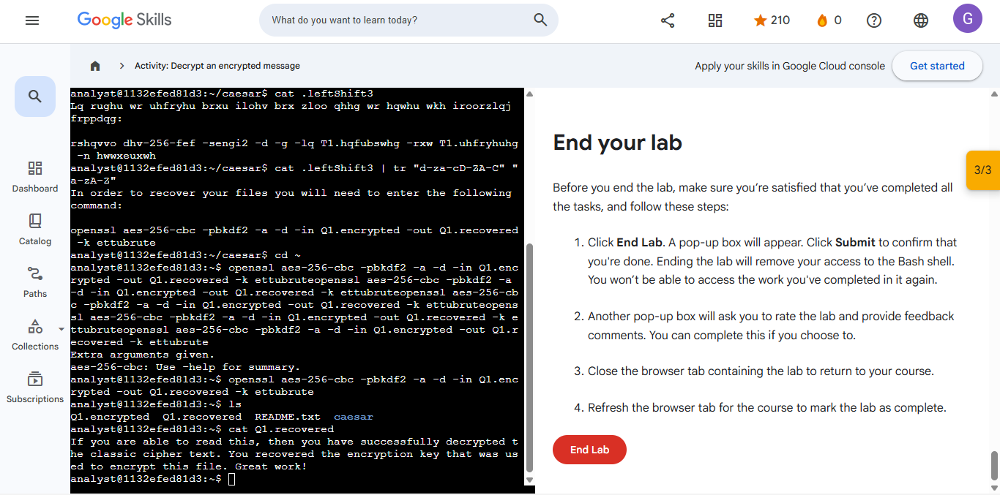
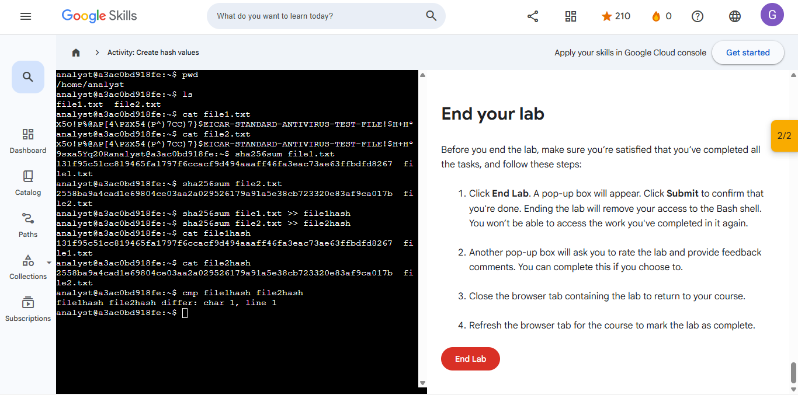
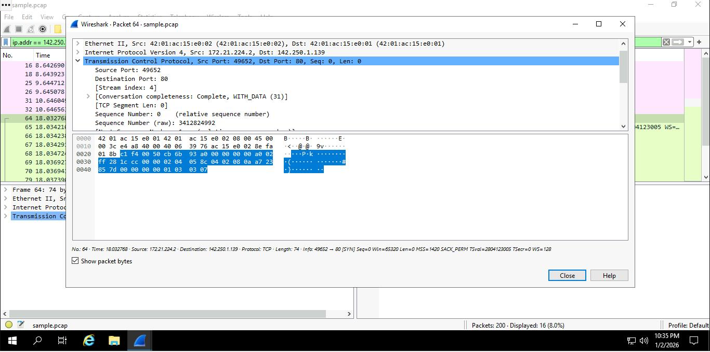

# 🛡️ THE CYBERSECURITY ANALYST'S TOOLKIT
### Linux Administration & SQL Data Forensics Portfolio

---

## 📜 Verified Professional Credentials
Click below to view the official PDF certifications.

| Google Cybersecurity Professional | IT Fundamentals (FC0-U71) |
| :---: | :---: |
|  |  *Udemy Training* |
| [📂 View Google PDF](./Google-Cybersecurity-Professional-Certificate.pdf) | [📂 View Udemy PDF](./CompTIA-IT-Fundamentals-FC0-U71-Udemy.pdf) |

---
## 📁 Featured Projects

### 🛡️ **Security Controls Assessment: Botium Toys**
**Governance, Risk & Compliance**

> **Objective:** Conducted a comprehensive internal audit to identify security gaps and misalignments using the **NIST Cybersecurity Framework (CSF)**.

* **Action:** Evaluated current security posture against industry standards to ensure organizational compliance.
* **Evidence:** [📄 View Audit & Compliance Checklist](./Governance-Risk-Compliance/Controls%20and%20compliance%20checklist.pdf)
* **Certification:** [🏅 Google: Play It Safe - Manage Security Risks](./Governance-Risk-Compliance/Google-Certificate-Play-It-Safe.pdf)

 

### 🌐 **Network Traffic Analysis: DNS & ICMP Troubleshooting**
**Network Security & Forensics**

> **Objective:** Utilized `tcpdump` to capture and analyze network layer communication to resolve connectivity issues.

* **Action:** Successfully identified "destination port unreachable" errors by isolating DNS issues on **UDP Port 53**.
* **Evidence:** [📄 View Traffic Analysis Report](./Network-Security/Network-Traffic-Analysis-Report.pdf)
* **Certification:** [🏅 Google: Connect and Protect - Network Security](./Network-Security/Google-Certificate-Network-Security.pdf)

---

# 🛡️ Google Cybersecurity Professional: Linux & SQL Security Project

**Verified Credential:** [📄 Google Certificate: Tools of the Trade](./Linux-Labs/Google-Certificate-Tools-of-the-Trade.pdf)

---

## 📋 Project Overview
> This project serves as a comprehensive technical portfolio demonstrating my ability to secure Linux systems and perform data forensics using SQL. This work was completed as part of the **Google Cybersecurity Professional Certificate**.

---

## 📜 Professional Certification

  
   
  
  **Google Certificate**
   
  **Official validation of skills in Linux, SQL, and Security Operations.**
  

---

## 🐧 1. Linux System Security & Administration
---

### 🛡️ **Access Control & Identity (Labs 1, 2)**
**User Management & Permissions**

> **Objective:** Enforce the Principle of Least Privilege (PoLP) by managing user access and system permissions.

* **Action:** Created and managed user accounts and modified file permissions/ownership to secure the environment.
* **Evidence:** 
  

 

### ⚙️ **System Hardening & Maintenance (Lab 3)**
**Software & Update Security**

> **Objective:** Secure the system by managing software installations and maintaining up-to-date security tools.

* **Action:** Utilized the `APT` package manager to install, update, and verify the integrity of security tools.
* **Evidence:** 

 

### 🔍 **Incident Response & Log Analysis (Lab 4)**
**Threat Hunting & Forensics**

> **Objective:** Proactively hunt for malicious activity and unauthorized access patterns within system logs.

* **Action:** Filtered large datasets using `grep` to isolate critical security events and identify potential threats.
* **Evidence:** 

 

### 📁 **Linux Foundations (Labs 5, 6)**
**Core Administration Skills**

* **Skills:** Proficient in **File Management** (`mv`, `cp`, `rm`), **System Navigation** (`find`, `locate`), and **Technical Documentation** (`man` pages).

---

## 📊 2. SQL Database Auditing & Forensics
---

### 🔎 **Data Extraction & Filtering (Labs 7, 8, 9)**
**Database Auditing**

> **Objective:** Identify unauthorized access attempts and suspicious patterns within a relational database.

* **Action:** Wrote SQL queries using `WHERE` clauses and `LIKE` wildcards to filter access logs for security auditing.
* **Evidence:** 
  
  

 

### 🔗 **Advanced Correlation & Logic (Labs 10, 11)**
**Forensic Data Correlation**

> **Objective:** Correlate disparate data sources to track threat actors and reconstruct security incidents.

* **Action:** Utilized `AND/OR/NOT` logic and `INNER JOIN` operations to merge user data with login tables for deeper investigation.
* **Evidence:** 
  

---
# 🛡️ Course: Assets, Threats, and Vulnerabilities 

This folder serves as a comprehensive portfolio for the "Assets, Threats, and Vulnerabilities" course. It documents the full security lifecycle: identifying assets, assessing risks, remediating incidents, and applying cryptographic controls.

---

### 📜 **Professional Certification**

  
   
  
  **Official validation of skills in NIST standards, risk management, and cryptography.**
   
  [📄 View Course Certificate](./NIST-Risk-Audit/Course_Certificate.pdf)

---

## 🧪 **Technical Audit & Lab Activities**

### 📋 **1. Asset Management: Comprehensive Asset Inventory**
**Governance, Risk & Compliance**
> **Objective:** Establish a formal audit baseline by identifying, categorizing, and valuing all organizational hardware and software assets to determine appropriate protection levels.

* **Action:** Created a centralized inventory tracking system, assigned data criticality levels, and mapped network-connected assets to business-critical functions.
* **Evidence:** [📄 View Asset_Inventory.csv](./NIST-Risk-Audit/Asset_Inventory.csv)

 

### 📊 **2. Risk Assessment: Score Risk Based on Likelihood and Impact**
**Threat Modeling & Risk Prioritization**
> **Objective:** Conduct a quantitative risk analysis using Likelihood × Impact scoring to prioritize remediation and align security resources with the highest business risks.

* **Action:** Developed a risk-scoring matrix to identify high-probability threats, establishing a technical foundation for implementing NIST-aligned security controls.
* **Evidence:** [📄 View Threat_Risk_Matrix.csv](./NIST-Risk-Audit/Threat_Risk_Matrix.csv)

 

### 📑 **3. Incident Analysis: Data Leak Recovery & Remediation**
**GRC Auditing & NIST Compliance**
> **Objective:** Investigate a security breach to determine the root cause of a data leak and implement corrective technical controls based on **NIST SP 800-53**.

* **Action:** Analyzed the leak's impact on data confidentiality, drafted a formal incident report, and recommended **NIST AC-6 (Least Privilege)** for future prevention.
* **Evidence:** [📄 View Data_Leak_Incident_Analysis_Report.pdf](./NIST-Risk-Audit/Data_Leak-Incident_Analysis_Report.pdf)

 

### 🔐 **4. Lab Practical: Data Decryption and Encryption**
**Cryptography & Data Protection**
> **Objective:** Mitigate the risk of unauthorized data exposure by implementing industrial-grade cryptographic handling for sensitive "Data at Rest" and "Data in Transit".

* **Action:** Evaluated the organizational security posture, utilized AES encryption/decryption tools to secure records, and successfully validated ciphertext recovery.
* **Lab Evidence:**

 

### 🛡️ **5. Lab Practical: Cryptographic Hashing**
**Asset Verification & Non-Repudiation**
> **Objective:** Ensure the absolute integrity of organizational assets by leveraging hash functions to verify that files remain unaltered by unauthorized actors.

* **Action:** Generated and compared SHA-256 cryptographic hash values for business-critical data sets to detect unauthorized tampering and ensure authenticity.
* **Lab Evidence:**

 

### 🔑 **6. Security Strategy: Access Control & AAA Protocols**
**Identity Management & Authorization**
> **Objective:** Reduce the organizational attack surface by strengthening **Authentication, Authorization, and Accounting (AAA)** protocols for network resources.

* **Action:** Designed an access control mitigation worksheet to enforce Multi-Factor Authentication (MFA) and granular, role-based permission levels.
* **Evidence:** [📄 View 6_Access_Control_Mitigation_Worksheet.pdf](./NIST-Risk-Audit/6_Access_Control_Mitigation_Worksheet.pdf)

 

### 🔍 **7. Audit Report: NIST Vulnerability Assessment**
**Risk Management Framework (RMF)**
> **Objective:** Conduct a systematic internal audit to identify technical security gaps and prioritize remediation using the NIST Cybersecurity Framework (CSF).

* **Action:** Performed a comprehensive vulnerability scan, identified high-risk entry points, and provided actionable remediation steps aligned with NIST standards.
* **Evidence:** [📄 View 7_Vulnerability_Assessment_Report.pdf](./NIST-Risk-Audit/7_Vulnerability_Assessment_Report.pdf)

 

### 💾 **8. Forensic Analysis: USB Attack Vector Investigation**
**Physical Security & Threat Forensics**
> **Objective:** Evaluate the security risks posed by unauthorized removable media and social engineering-driven malware delivery.

* **Action:** Isolated and analyzed attack paths involving physical USB drives, focusing on malware propagation and unauthorized data exfiltration methods.
* **Evidence:** [📄 View 8_USB_Attack_Vector_Analysis.pdf](./NIST-Risk-Audit/8_USB_Attack_Vector_Analysis.pdf)

 

### 🎯 **9. Advanced Modeling: PASTA Threat Model Framework**
**Strategic Defense & Attack Simulation**
> **Objective:** Apply the 7-stage PASTA framework to simulate sophisticated attack paths and align technical defenses with business objectives.

* **Action:** Modeled SQL Injection exploitation paths against a mobile application to recommend defenses like Parameterized Queries and PKI.
* **Evidence:** [📄 View 9_PASTA_Threat_Model_SneakerAPP.pdf](./NIST-Risk-Audit/9_PASTA_Threat_Model_SneakerAPP.pdf)

---
# Course 4: Sound the Alarm: Detection and Response

  
  
   
  

> **Note:** This folder documents my technical progression through Course 4, focusing on incident detection frameworks and deep-packet analysis.

---

## 🛡️ Topic 1: Incident Analysis (Healthcare Ransomware)

### **Objective**
Analyze a simulated ransomware attack on a healthcare clinic to determine the impact on patient care and business operations.

### **Description**
Developed an incident overview following the NIST Incident Response lifecycle. I evaluated the risks associated with encrypted patient records and determined the necessity of immediate containment to prevent further spread of the malware.

**📄 Evidence:** [View Ransomware Analysis in Journal](./Detection-and-Response/Incident_Handlers_Journal.pdf#page=1)

---

## 🔍 Topic 2: Network Traffic Analysis (Wireshark)

### **Objective**
Perform Deep Packet Inspection (DPI) to identify indicators of compromise (IoCs) and verify TCP protocol integrity.

### **Tools Used**
* **Wireshark**: For packet capture and deep-packet inspection.
* **Linux Terminal**: For local network environment management.

### **Description**
Analyzed a `.pcap` file to identify specific communication patterns. I verified the use of TCP Port 80 for unencrypted web traffic and confirmed that the network session reached a status of **'Complete, WITH_DATA,'** proving a successful three-way handshake and data exchange occurred.

### **Technical Evidence**

  
   
  <i><b>Figure 3:</b> Detailed inspection of the TCP header identifying source/destination ports and conversation completeness.</i>

**📄 Evidence:** [View Technical Packet Log in Journal](./Detection-and-Response/Incident_Handlers_Journal.pdf#page=2)

---

  
   
  

*⬅️ [Back to GiftTech Main Page](../../)*
