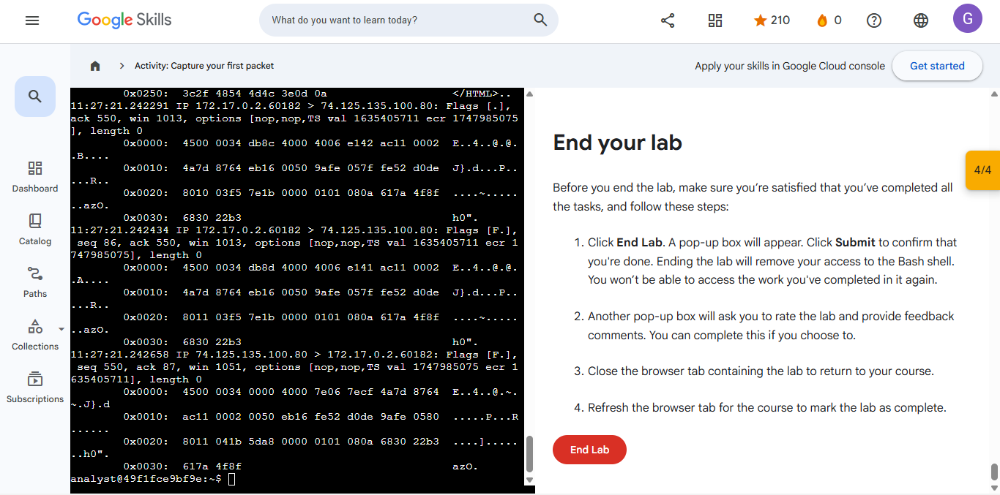
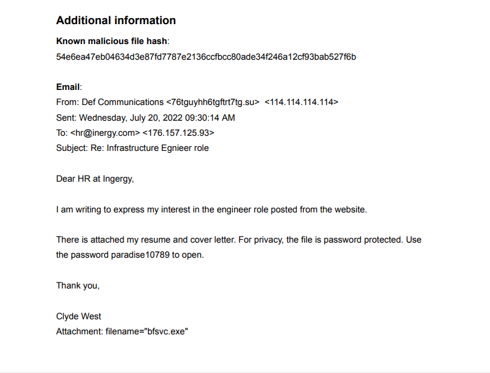
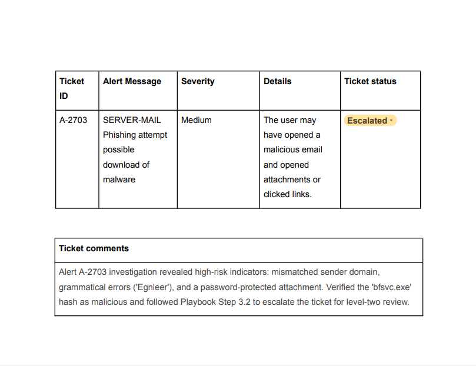
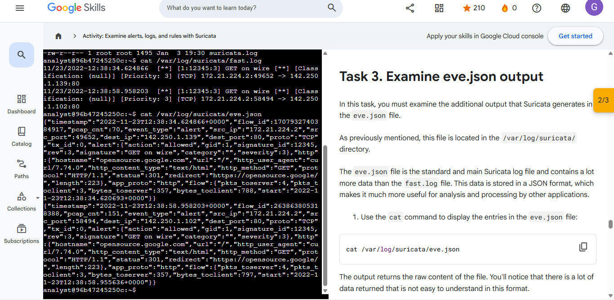
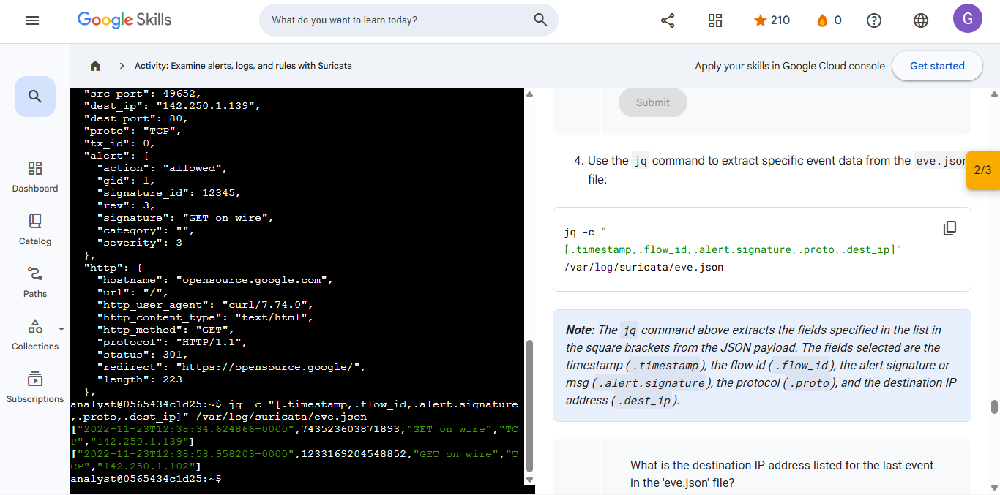
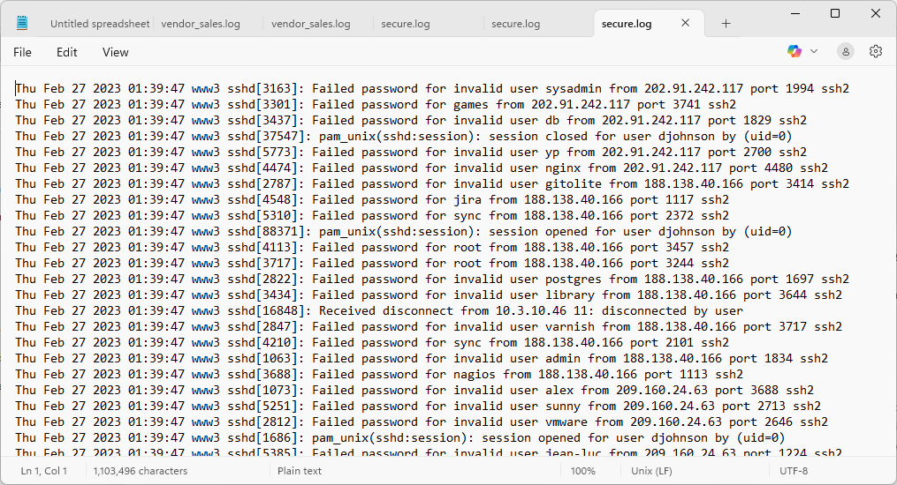

# 🛡️ THE CYBERSECURITY ANALYST'S TOOLKIT
### Linux Administration & SQL Data Forensics Portfolio

---

## 📜 Verified Professional Credentials
Click below to view the official PDF certifications.

| Google Cybersecurity Professional | IT Fundamentals (FC0-U71) |
| :---: | :---: |
|  |  *Udemy Training* |
| [📂 View Google PDF](./Google-Cybersecurity-Professional-Certificate.pdf) | [📂 View Udemy PDF](./CompTIA-IT-Fundamentals-FC0-U71-Udemy.pdf) |

---
## 📁 Featured Projects

### 🛡️ **Security Controls Assessment: Botium Toys**
**Governance, Risk & Compliance**

> **Objective:** Conducted a comprehensive internal audit to identify security gaps and misalignments using the **NIST Cybersecurity Framework (CSF)**.

* **Action:** Evaluated current security posture against industry standards to ensure organizational compliance.
* **Evidence:** [📄 View Audit & Compliance Checklist](./Governance-Risk-Compliance/Controls%20and%20compliance%20checklist.pdf)
* **Certification:** [🏅 Google: Play It Safe - Manage Security Risks](./Governance-Risk-Compliance/Google-Certificate-Play-It-Safe.pdf)

 

### 🌐 **Network Traffic Analysis: DNS & ICMP Troubleshooting**
**Network Security & Forensics**

> **Objective:** Utilized `tcpdump` to capture and analyze network layer communication to resolve connectivity issues.

* **Action:** Successfully identified "destination port unreachable" errors by isolating DNS issues on **UDP Port 53**.
* **Evidence:** [📄 View Traffic Analysis Report](./Network-Security/Network-Traffic-Analysis-Report.pdf)
* **Certification:** [🏅 Google: Connect and Protect - Network Security](./Network-Security/Google-Certificate-Network-Security.pdf)

---

# 🛡️ Google Cybersecurity Professional: Linux & SQL Security Project

**Verified Credential:** [📄 Google Certificate: Tools of the Trade](./Linux-Labs/Google-Certificate-Tools-of-the-Trade.pdf)

---

## 📋 Project Overview
> This project serves as a comprehensive technical portfolio demonstrating my ability to secure Linux systems and perform data forensics using SQL. This work was completed as part of the **Google Cybersecurity Professional Certificate**.

---

## 📜 Professional Certification

  
   
  
  **Google Certificate**
   
  **Official validation of skills in Linux, SQL, and Security Operations.**
  

---

## 🐧 1. Linux System Security & Administration
---

### 🛡️ **Access Control & Identity (Labs 1, 2)**
**User Management & Permissions**

> **Objective:** Enforce the Principle of Least Privilege (PoLP) by managing user access and system permissions.

* **Action:** Created and managed user accounts and modified file permissions/ownership to secure the environment.
* **Evidence:** 
  

 

### ⚙️ **System Hardening & Maintenance (Lab 3)**
**Software & Update Security**

> **Objective:** Secure the system by managing software installations and maintaining up-to-date security tools.

* **Action:** Utilized the `APT` package manager to install, update, and verify the integrity of security tools.
* **Evidence:** 

 

### 🔍 **Incident Response & Log Analysis (Lab 4)**
**Threat Hunting & Forensics**

> **Objective:** Proactively hunt for malicious activity and unauthorized access patterns within system logs.

* **Action:** Filtered large datasets using `grep` to isolate critical security events and identify potential threats.
* **Evidence:** 

 

### 📁 **Linux Foundations (Labs 5, 6)**
**Core Administration Skills**

* **Skills:** Proficient in **File Management** (`mv`, `cp`, `rm`), **System Navigation** (`find`, `locate`), and **Technical Documentation** (`man` pages).

---

## 📊 2. SQL Database Auditing & Forensics
---

### 🔎 **Data Extraction & Filtering (Labs 7, 8, 9)**
**Database Auditing**

> **Objective:** Identify unauthorized access attempts and suspicious patterns within a relational database.

* **Action:** Wrote SQL queries using `WHERE` clauses and `LIKE` wildcards to filter access logs for security auditing.
* **Evidence:** 
  
  

 

### 🔗 **Advanced Correlation & Logic (Labs 10, 11)**
**Forensic Data Correlation**

> **Objective:** Correlate disparate data sources to track threat actors and reconstruct security incidents.

* **Action:** Utilized `AND/OR/NOT` logic and `INNER JOIN` operations to merge user data with login tables for deeper investigation.
* **Evidence:** 
  

---
# 🛡️ Course: Assets, Threats, and Vulnerabilities 

This folder serves as a comprehensive portfolio for the "Assets, Threats, and Vulnerabilities" course. It documents the full security lifecycle: identifying assets, assessing risks, remediating incidents, and applying cryptographic controls.

---

### 📜 **Professional Certification**

  
   
  
  **Official validation of skills in NIST standards, risk management, and cryptography.**
   
  [📄 View Course Certificate](./NIST-Risk-Audit/Asset_Course_Certificate.pdf)

---

## 🧪 **Technical Audit & Lab Activities**

### 📋 **1. Asset Management: Comprehensive Asset Inventory**
**Governance, Risk & Compliance**
> **Objective:** Establish a formal audit baseline by identifying, categorizing, and valuing all organizational hardware and software assets to determine appropriate protection levels.

* **Action:** Created a centralized inventory tracking system, assigned data criticality levels, and mapped network-connected assets to business-critical functions.
* **Evidence:** [📄 View Asset_Inventory.csv](./NIST-Risk-Audit/Asset_Inventory.csv)

 

### 📊 **2. Risk Assessment: Score Risk Based on Likelihood and Impact**
**Threat Modeling & Risk Prioritization**
> **Objective:** Conduct a quantitative risk analysis using Likelihood × Impact scoring to prioritize remediation and align security resources with the highest business risks.

* **Action:** Developed a risk-scoring matrix to identify high-probability threats, establishing a technical foundation for implementing NIST-aligned security controls.
* **Evidence:** [📄 View Threat_Risk_Matrix.csv](./NIST-Risk-Audit/Threat_Risk_Matrix.csv)

 

### 📑 **3. Incident Analysis: Data Leak Recovery & Remediation**
**GRC Auditing & NIST Compliance**
> **Objective:** Investigate a security breach to determine the root cause of a data leak and implement corrective technical controls based on **NIST SP 800-53**.

* **Action:** Analyzed the leak's impact on data confidentiality, drafted a formal incident report, and recommended **NIST AC-6 (Least Privilege)** for future prevention.
* **Evidence:** [📄 View Data_Leak_Incident_Analysis_Report.pdf](./NIST-Risk-Audit/Data_Leak-Incident_Analysis_Report.pdf)

 

### 🔐 **4. Lab Practical: Data Decryption and Encryption**
**Cryptography & Data Protection**
> **Objective:** Mitigate the risk of unauthorized data exposure by implementing industrial-grade cryptographic handling for sensitive "Data at Rest" and "Data in Transit".

* **Action:** Evaluated the organizational security posture, utilized AES encryption/decryption tools to secure records, and successfully validated ciphertext recovery.
* **Lab Evidence:**

 

### 🛡️ **5. Lab Practical: Cryptographic Hashing**
**Asset Verification & Non-Repudiation**
> **Objective:** Ensure the absolute integrity of organizational assets by leveraging hash functions to verify that files remain unaltered by unauthorized actors.

* **Action:** Generated and compared SHA-256 cryptographic hash values for business-critical data sets to detect unauthorized tampering and ensure authenticity.
* **Lab Evidence:**

 

### 🔑 **6. Security Strategy: Access Control & AAA Protocols**
**Identity Management & Authorization**
> **Objective:** Reduce the organizational attack surface by strengthening **Authentication, Authorization, and Accounting (AAA)** protocols for network resources.

* **Action:** Designed an access control mitigation worksheet to enforce Multi-Factor Authentication (MFA) and granular, role-based permission levels.
* **Evidence:** [📄 View 6_Access_Control_Mitigation_Worksheet.pdf](./NIST-Risk-Audit/6_Access_Control_Mitigation_Worksheet.pdf)

 

### 🔍 **7. Audit Report: NIST Vulnerability Assessment**
**Risk Management Framework (RMF)**
> **Objective:** Conduct a systematic internal audit to identify technical security gaps and prioritize remediation using the NIST Cybersecurity Framework (CSF).

* **Action:** Performed a comprehensive vulnerability scan, identified high-risk entry points, and provided actionable remediation steps aligned with NIST standards.
* **Evidence:** [📄 View 7_Vulnerability_Assessment_Report.pdf](./NIST-Risk-Audit/7_Vulnerability_Assessment_Report.pdf)

 

### 💾 **8. Forensic Analysis: USB Attack Vector Investigation**
**Physical Security & Threat Forensics**
> **Objective:** Evaluate the security risks posed by unauthorized removable media and social engineering-driven malware delivery.

* **Action:** Isolated and analyzed attack paths involving physical USB drives, focusing on malware propagation and unauthorized data exfiltration methods.
* **Evidence:** [📄 View 8_USB_Attack_Vector_Analysis.pdf](./NIST-Risk-Audit/8_USB_Attack_Vector_Analysis.pdf)

 

### 🎯 **9. Advanced Modeling: PASTA Threat Model Framework**
**Strategic Defense & Attack Simulation**
> **Objective:** Apply the 7-stage PASTA framework to simulate sophisticated attack paths and align technical defenses with business objectives.

* **Action:** Modeled SQL Injection exploitation paths against a mobile application to recommend defenses like Parameterized Queries and PKI.
* **Evidence:** [📄 View 9_PASTA_Threat_Model_SneakerAPP.pdf](./NIST-Risk-Audit/9_PASTA_Threat_Model_SneakerAPP.pdf)

---
# 🛡️ Sound the Alarm: Detection and Response 

This folder serves as a comprehensive portfolio for the "Detection and Response" module. It documents technical proficiency in identifying security incidents, analyzing network traffic, and performing forensic packet inspection.

> **Note:** This folder documents my technical progression through Course 4, focusing on incident detection frameworks and deep-packet analysis.

---

### 📜 **Professional Certification**

  
   
  
  **Official validation of skills in NIST standards, risk management, and cryptography.**
   
  [📄 View Course Certificate](./Detection-and-Response/Detection_Certificate.pdf)

---

## 🧪 **Technical Analysis & Lab Activities**

### 📋 **1. Incident Analysis: Healthcare Ransomware Scenario**
**Incident Response & Business Continuity**
> **Objective:** Analyze a simulated ransomware attack on a healthcare clinic to determine the impact on patient care and business operations.

* **Action:** Developed a formal incident overview by following the NIST Incident Response lifecycle, identifying risks to patient data and recommending immediate containment steps.
* **Evidence:** [📄 View Incident_Handlers_Journal.pdf](./Detection-and-Response/Incident_Handlers_Journal.pdf#page=1)

 

### 🔍 **2. Lab Practical: Analyze Your First Packet**
**Network Traffic Analysis & Forensic Inspection**
> **Objective:** Perform Deep Packet Inspection (DPI) to identify indicators of compromise (IoCs) and verify TCP protocol integrity.

* **Action:** Utilized Wireshark to analyze a `.pcap` file, isolating TCP Port 80 traffic and confirming "Complete, WITH_DATA" status to verify successful data exchange.
* **Lab Evidence:**

 

**Figure 3: Detailed inspection of the TCP header identifying source/destination ports and conversation completeness.**

 

---

 

 

### 🖥️ **3. CLI Lab: Network Observation with tcpdump**
**Command-Line Traffic Analysis & Forensic Inspection**
> **Objective:** Identify active network interfaces and utilize the `tcpdump` utility to capture, filter, and inspect live packet payloads within a Linux environment.

* **Action:** Mapped hardware interfaces via `ifconfig`, intercepted real-time HTTP traffic on `eth0`, and performed advanced forensic filtering using hexadecimal and ASCII output formats to verify protocol integrity.

#### **Lab Evidence**

*Figure 4: Command-line interface packet capture showing deep packet inspection and payload analysis.*

* **Evidence:** [📄 View tcpdump Analysis in Journal](./Detection-and-Response/Incident_Handlers_Journal.pdf#page=3)

---
### 🛡️ **4. Phishing Incident Response**
**Email Artifact Analysis & Forensic Escalation**
> **Objective:** Identify high-risk indicators within suspicious email artifacts and perform a formal escalation of an infected workstation alert.

* **Action:** Analyzed email headers for sender mismatches, identified social engineering red flags ("Egnieer"), verified a malicious SHA256 file hash, and updated the incident ticket status to **Escalated**.

#### **Lab Evidence**

*Figure 5: Identification of suspicious sender domain, grammatical errors, and malicious attachment hash.*

*Figure 6: Alert ticket updated to Escalated status with professional analyst documentation.*

**Evidence:** [📄 View Phishing Analysis in Journal](./Detection-and-Response/Incident_Handlers_Journal.pdf#page=4)

---

### 🛡️ **5. Intrusion Detection Analysis**
**Suricata IDS Alerting & JSON Metadata Parsing**
> **Objective:** Investigate network security events by executing Suricata against packet captures to identify signature-based triggers and validate IDS rule effectiveness.

* **Action:** Deployed Suricata in read-pcap mode, analyzed `fast.log` for immediate alerts, and utilized `jq` to parse the `eve.json` telemetry for deep-flow analysis of Port 80 traffic.

"Date: January 3,
","Entry: #5
"
"2026.
",
"Description
","Conducted a forensic review of network traffic by running Suricata against a
 sample.pcap file. Analyzed both standard alerts in fast.log and detailed JSON
 telemetry in eve.json to verify signature triggers."
"Tool(s) used
","Suricata IDS, Linux CLI, cat, jq"
"The 5 W's
","• Who: Cybersecurity Analyst / SOC Team."
,"• What: Identified ""GET on wire"" HTTP alerts and parsed log metadata."
,"• When: During active network traffic inspection using read-pcap mode."
,"• Where: Communication between local IP 172.21.224.2 and external IP 142.250.1.139."
,"• Why: To validate the effectiveness of custom IDS rules in detecting outbound HTTP requests."

#### **Lab Evidence**

*Figure 7: Inspection of fast.log identifying "GET on wire" alerts with Signature ID: 12345.*

*Figure 8: Refined jq query extracting flow-specific metadata and destination IPs from eve.json.*

**Evidence:** [📄 View IDS Analysis in Journal](./Detection-and-Response/Incident_Handlers_Journal.pdf#page=5)

---

### 🛡️ **6. Security Monitoring & SIEM Querying**
**Wazuh Threat Hunting & Log Correlation**
> **Objective:** Execute a targeted threat hunt using SIEM logic to isolate unauthorized brute-force patterns within a 100,000+ event dataset.

* **Action:** Configured Wazuh KQL filters to monitor the **www3** host, successfully identified 300+ root-level authentication failures, and correlated SIEM alerts with raw `secure.log` data to verify the attack vector.

"Date: January 4,
","Entry: #6
"
"2026.
",
"Description
","Simulated Threat Hunt: Analyzed historical security telemetry from the Buttercup
 Games dataset using the Wazuh dashboard to isolate unauthorized access attempts."
"Tool(s) used
","Wazuh SIEM, Kibana Query Language (KQL)"
"The 5 W's
","• Who: Potential malicious actors or automated scripts."
,"• What: Identified over 300 failed SSH login attempts for the ""root"" account.
,"• When: Historical activity captured within the logs."
,"• Where: The **www3** web server."
,"• Why: Brute-force attack pattern targeting administrative credentials."

#### **Lab Evidence**

*Figure 9: Manual forensic verification of raw secure.log artifacts confirming the brute-force attempt.*

**Evidence:** [📄 View SIEM Analysis in Journal](./Detection-and-Response/Incident_Handlers_Journal.pdf#page=6)

 

---

 

# 🐍 Automate Cybersecurity Tasks with Python
**Google Cybersecurity Professional Certificate | Technical Portfolio**

  
   
  
  **Official validation of skills in NIST standards, risk management, and cryptography.**
   
  
### 🎓 **Professional Certification**
**Google Python Automation Specialist**
> **Objective:** Mastered Python fundamentals to automate security workflows, parse complex log files, and develop remediation algorithms.

"Date: January 5, 2026", "Entry: #1", "Tool(s) used: Python 3.x, VS Code, Jupyter"
**Credential:** [📜 View Professional Certificate](./Automate-Task-With-Python/Python_Automation_Certificate.pdf)

---

### 🛡️ **1. User-to-Device Verification Algorithm**
**Conditional Logic & Data Correlation**
> **Objective:** Connect users to their assigned devices by cross-referencing usernames with hardware IDs to detect unauthorized system access.

* **Action:** Created an automated verification function using `.index()` and nested `if/else` statements to confirm if a user is operating their designated equipment.

"Date: January 5, 2026", "Entry: #2"
"Description: Algorithmic verification of user-device affinity to prevent hardware misuse."
"Tool(s) used: Python (Conditional Statements, List Indexing)"
"The 5 W's: 
• Who: Internal employees and assigned hardware assets.
• What: Automated check for hardware-to-user alignment.
• When: System login or hardware audit phase.
• Where: Corporate network infrastructure.
• Why: To prevent unauthorized users from accessing the system on unassigned devices."

**Evidence:** [🧪 View Verification Lab Analysis](./Automate-Task-With-Python/Activity_Develop%20an%20algorithm-1.pdf)

---

### 🛡️ **2. Security Log Pattern Analysis (Regex)**
**Regular Expressions & Log Parsing**
> **Objective:** Execute a targeted extraction of device IDs and IP addresses from login logs to identify vulnerabilities.

* **Action:** Configured `re.findall()` patterns to isolate devices requiring critical software updates and correlate flagged IP addresses.

"Date: January 4, 2026", "Entry: #3"
"Description: Used Regular Expressions to automate the identification of outdated systems and malicious IPs."
"Tool(s) used: Python `re` Module"
"The 5 W's: 
• Who: Potential malicious actors and outdated network devices.
• What: Automated extraction of specific device IDs and IP addresses.
• When: Scheduled log monitoring and vulnerability scanning.
• Where: System login attempts and device logs.
• Why: To automate the detection of security vulnerabilities and brute-force attempts."

**Evidence:** [🧪 View Regex Pattern Analysis](./Automate-Task-With-Python/Activity_Use%20regular%20expressions%20to%20find%20patterns.pdf)

---

### 🛡️ **3. Import and Parse Security Logs**
**File I/O & String Manipulation**
> **Objective:** Automate the process of importing and parsing large text-based security logs to extract specific login attempt data.

* **Action:** Utilized the `.read()` and `.split()` methods to transform raw text file data into manageable lists for security analysis.

"Date: January 5, 2026", "Entry: #4"
"Description: Developed scripts to efficiently access and parse information from text-based security logs."
"Tool(s) used: Python (File Handling, String Methods)"
"The 5 W's: 
• Who: Security analysts managing large log datasets.
• What: Processed login data to extract specific fields.
• When: During routine security log reviews.
• Where: Organization's internal security database.
• Why: To allow analysts to efficiently access information from text files."

**Evidence:** [🧪 View Log Parsing Lab Analysis](./Automate-Task-With-Python/Activity_Import%20and%20parse%20a%20text%20file.pdf)

---

### 🛡️ **4. Technical Foundation: Algorithm Development**
**File Handling & Remediation Logic**
> **Objective:** Develop a Python algorithm to automate the removal of unauthorized IP addresses from a restricted healthcare access file.

* **Action:** Implemented `with open()` for secure file access, utilized `.split()` for data parsing, and built a `for` loop with `.remove()` logic to programmatically purge unauthorized IPs.

"Date: January 5, 2026", "Entry: #5"
"Description: Technical foundation for automated maintenance of an IP 'allow list'."
"Tool(s) used: Python (File I/O, List Methods)"
"The 5 W's: 
• Who: Security Analyst at a Healthcare organization.
• What: Removed unauthorized IP addresses from the allow_list.txt file.
• When: Real-time update during the access review process.
• Where: Restricted subnetwork server.
• Why: To maintain data privacy and system integrity by revoking access for unauthorized users."

**Evidence:** [🧪 View Algorithmic Logic Lab Analysis](./Automate-Task-With-Python/Activity_Create%20another%20algorithm.pdf)

---

### 🛡️ **5. PORTFOLIO PIECE: Automated ACL Updates**
**Advanced Remediation Algorithm**
> **Objective:** Execute an automated remediation workflow to secure a restricted healthcare subnetwork by programmatically updating access permissions.

* **Action:** Developed a modular Python script that parses server logs, identifies unauthorized entries, and rewrites the permission file to ensure 100% compliance with access policies.

"Date: January 5, 2026", "Entry: #6"
"Description: FINAL PORTFOLIO PROJECT: A comprehensive security automation tool for managing server access."
"Tool(s) used: Python, File I/O, List Manipulation"
"The 5 W's: 
• Who: Senior Security Analyst.
• What: Automated the cleanup of a restricted IP allow list.
• When: Project completion phase of the Python Automation course.
• Where: Healthcare Network Infrastructure.
• Why: To demonstrate professional-grade automation and secure data handling."

#### **Portfolio Evidence**

**Evidence:** [📄 View Numbered Portfolio Report](./Automate-Task-With-Python/Automated_ACL_Update_Project.pdf)

 

# 📈 Cybersecurity Career Strategy & AI Optimization
**Google Cybersecurity Professional Certificate | Professional Growth Portfolio**

---

### 🛡️ **1. Prepare for Cybersecurity Jobs**

  
   
  
  **Credential:** [📜 View Job Preparation Certificate](./Cybersecurity-Career-Development/Prepare_for_Cybersecurity_Jobs_Certificate.pdf)
   
  
  **Official validation of skills in NIST standards, risk management, and professional readiness.**

> **Objective:** Translate technical proficiency into professional value by aligning hands-on experience with the NIST Cybersecurity Framework (CSF).

* **Action:** Created a professional narrative by mapping technical lab activities (Python automation, SIEM analysis) to the **Identify, Protect, Detect, Respond, and Recover** functions of the NIST CSF.

"Entry: #1", "Focus: Professional Readiness & Portfolio Strategy"
"The 5 W's: 
• Who: Aspiring Cybersecurity Analyst.
• What: Strategic alignment of technical skills with organizational security goals.
• When: Career preparation and job market entry phase.
• Where: Professional networking platforms and technical portfolios (GitHub/LinkedIn).
• Why: To bridge the gap between "learning a skill" and "solving business security risks" for hiring managers."

---

### 🤖 **2. Accelerate Your Job Search with AI**

  
   
  
  **Credential:** [📜 View AI Strategy Certificate](./Cybersecurity-Career-Development/Accelerate_with_AI_Certificate.pdf)
   
  
  **Official validation of skills in Generative AI for professional workflow optimization.**

> **Objective:** Leverage Generative AI tools to enhance the quality of technical documentation and increase efficiency in the job application lifecycle.

* **Action:** Mastered prompt engineering techniques to refine technical summaries, optimize resumes for Applicant Tracking Systems (ATS), and practice technical interview scenarios using AI as a simulator.

"Entry: #2", "Focus: Generative AI & Productivity"
"The 5 W's: 
• Who: Tech-forward Security Professional.
• What: Application of Generative AI for professional branding and technical writing.
• When: Advanced job search and interview preparation phase.
• Where: Technical documentation and professional communications.
• Why: To stay competitive in a tech-driven market and demonstrate the ability to use AI for operational efficiency."

---

  
**Verified by Google: Professional readiness in the cybersecurity ecosystem.**

  

---

 

*⬅️ [Back to GiftTech Main Page](../../)*
