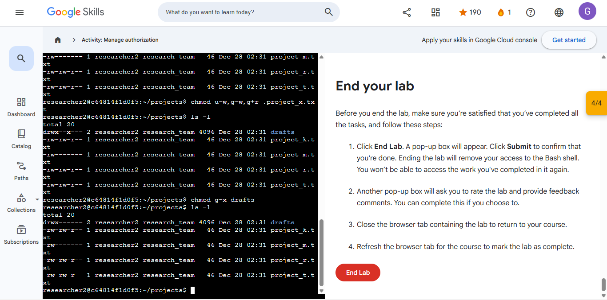
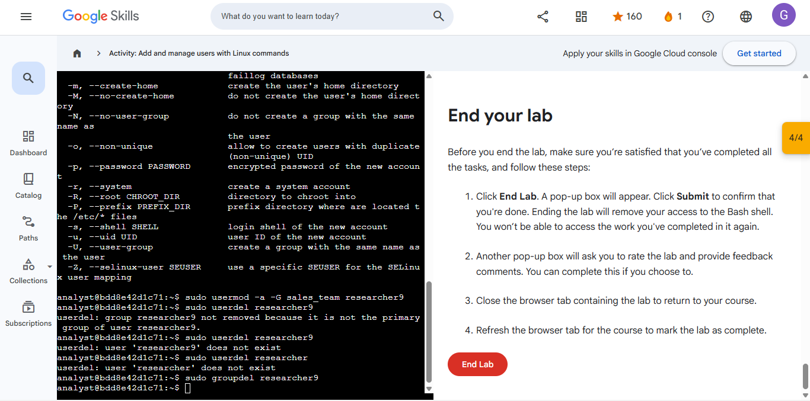
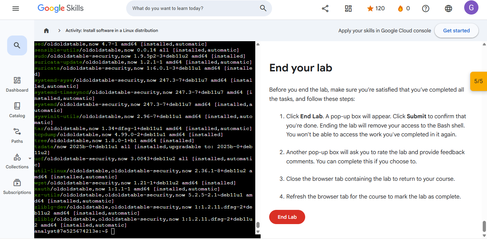
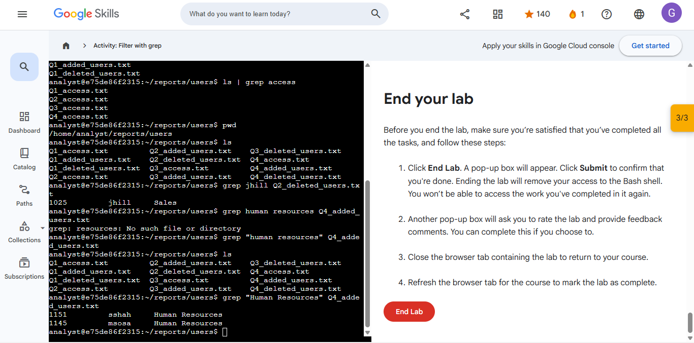
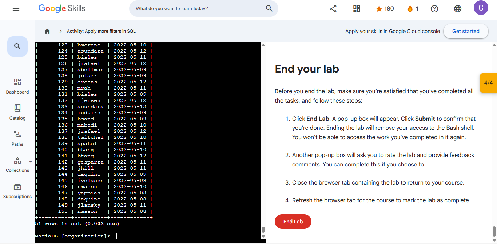
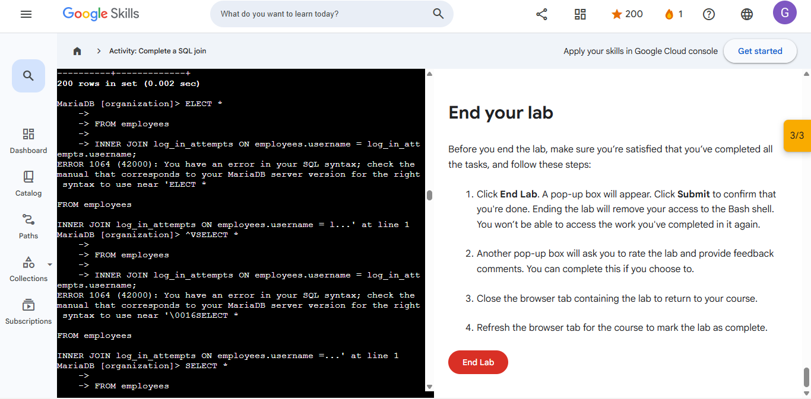

 🛡️ Cybersecurity & Tech Portfolio

I am a proactive technology professional focused on the critical intersection of network security and systems resilience.

      🛠️ Technical Toolkit
- **Security Foundations**: Threat Detection, Incident Response, and SQL for Data-Driven Audits.
- **Programming**: Python scripting for security automation and network defense.
- **Mathematics**: Currently advancing my background in Linear Algebra and logic.

    📜 Certifications
- **Google Cybersecurity Professional Certificate** (Complete suite of 8 specialized courses)
- **Python for Security Automation**
- **FCO-U71

---
## 📁 Featured Projects

### [Security Controls Assessment: Botium Toys](./Governance-Risk-Compliance/)
* **Objective:** Conducted an audit to find security gaps using the NIST framework.
* **Evidence:** [View Audit PDF](./Governance-Risk-Compliance/Controls%20and%20compliance%20checklist.pdf)
* **Certification:** [Google: Play It Safe - Manage Security Risks](./Governance-Risk-Compliance/Google-Certificate-Play-It-Safe.pdf)

### [Network Traffic Analysis: DNS & ICMP Troubleshooting](./Network-Security/Network-Traffic-Analysis-Report.pdf)
* **Objective:** Used tcpdump to analyze network layer communication and troubleshoot "destination port unreachable" errors by identifying DNS issues over UDP port 53.
* **Evidence:** [View Traffic Analysis PDF](./Network-Security/Network-Traffic-Analysis-Report.pdf)
* **Certification:** [Google: Connect and Protect - Network Security](./Network-Security/Google-Certificate-Network-Security.pdf)

# 🛡️ Google Cybersecurity Professional: Linux & SQL Security Project
**Verified Credential:** [Google Certificate: Tools of the Trade](./Linux-Labs/Google-Certificate-Tools-of-the-Trade.pdf)

## 📋 Project Overview
This project serves as a comprehensive technical portfolio demonstrating my ability to secure Linux systems and perform data forensics using SQL. This work was completed as part of the **Google Cybersecurity Professional Certificate**.

---

## 📜 Professional Certification

*Official validation of skills in Linux, SQL, and Security Operations.*

---

## 🐧 1. Linux System Security & Administration
*I utilized the Linux Command Line (CLI) to manage users, enforce security policies, and investigate system logs.*

### 🛡️ Access Control & Identity (Labs 1, 2)
* **Objective:** Enforce the Principle of Least Privilege (PoLP).
* **Action:** Managed user accounts and modified file permissions/ownership.
* **Evidence:** 
  

### ⚙️ System Hardening & Maintenance (Lab 3)
* **Objective:** Secure the system by managing software and updates.
* **Action:** Used `APT` package manager to install and verify security tools.
* **Evidence:** 

### 🔍 Incident Response & Log Analysis (Lab 4)
* **Objective:** Hunt for malicious activity within system logs.
* **Action:** Filtered large datasets using `grep` to isolate security events.
* **Evidence:** 

### 📁 Linux Foundations (Labs 5, 6)
* **Skills:** Proficient in **File Management** (mv, cp, rm), **Finding Files** (find, locate), and **Technical Documentation** (man pages).

---

## 📊 2. SQL Database Auditing & Forensics
*I performed relational database queries to audit access logs and correlate data during security investigations.*

### 🔎 Data Extraction & Filtering (Labs 7, 8, 9)
* **Objective:** Identify unauthorized access attempts within a database.
* **Action:** Wrote SQL queries using `WHERE` clauses and `LIKE` wildcards.
* **Evidence:** 
  
  

### 🔗 Advanced Correlation & Logic (Labs 10, 11)
* **Objective:** Link disparate data sources to track threat actors.
* **Action:** Utilized `AND/OR/NOT` logic and `INNER JOIN` to merge user and login tables.
* **Evidence:** 
  

---

## 🛠️ Tools & Technologies Used
* **Operating System:** Linux (Ubuntu/Debian-based)
* **Languages:** Bash Scripting, SQL
* **Security Tools:** APT, Grep, Chmod/Chown
* **Methodology:** Principle of Least Privilege, Data Normalization, Log Auditing
